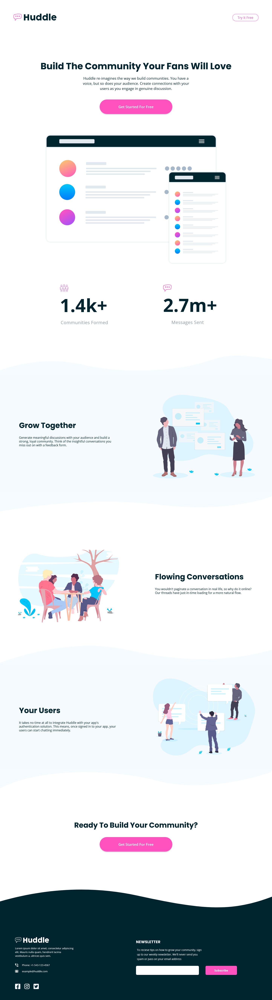
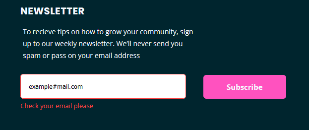

# Frontend Mentor - Huddle landing page with curved sections solution

This is a solution to the [Huddle landing page with curved sections challenge on Frontend Mentor](https://www.frontendmentor.io/challenges/huddle-landing-page-with-curved-sections-5ca5ecd01e82137ec91a50f2). Frontend Mentor challenges help you improve your coding skills by building realistic projects. 

## Table of contents

- [Overview](#overview)
  - [The challenge](#the-challenge)
  - [Screenshot](#screenshot)
  - [Links](#links)
- [My process](#my-process)
  - [Built with](#built-with)
  - [What I learned](#what-i-learned)
  - [Continued development](#continued-development)
  - [Useful resources](#useful-resources)
- [Author](#author)

## Overview

### The challenge

Users should be able to:

- View the optimal layout for the site depending on their device's screen size
- See hover states for all interactive elements on the page

### Screenshot



### Links

- Solution URL: [Add solution URL here](https://www.frontendmentor.io/solutions/cssflexbox-bem-methodology-javascript-mobilefirst-workflow-v-trO_L4I)
- Live Site URL: [Add live site URL here](https://abdielp.github.io/curve-landing-page/)

## My process

### Built with

- Semantic HTML5 markup
- CSS custom properties
- BEM methodology — Block Element Modifier
- Flexbox
- Mobile-first workflow
- Javascript
  - Module design pattern

### What I learned

I've been coding for some years so CSS isn't something new for me, but this is my first time trying to use BEM methodology. As this is something new for me, i do not spect to do it perfect, but i will keep learned and improving my skills. 
This is the first step building a portafolio, so i do appreciate the feedback and all your good comments ;)

## Form validation

In the subscription form section, the code compares the email input value against a regular expression trought the test() function. it's return true or false, and depends of result, it's show or hide the error message and apply the error styles.



I made this part with vanilla Javascript, using the module pattern estructure. 

```js
(() => {
    const App = {
        htmlElements: {
            form: document.getElementById('form'),
            input: document.getElementById('input-email'),
            error: document.getElementById('error-message')
        },
        init: () => {
            App.bindEvents();
        },
        bindEvents: () => {
            App.htmlElements.form.addEventListener('submit', App.events.subscribe)
        },
        events: {
            subscribe: (event) => {
                event.preventDefault();
                App.utils.validateForm(App.htmlElements.input.value);
            }
        },
        utils: {
            validateForm: (value) => {
                const regex = /[a-z0-9._%+-]+@[a-z0-9.-]+\.[a-z]{2,3}$/
                const validate = regex.test(value);
                if (!validate) {
                    App.htmlElements.error.style.display = 'block';
                    App.htmlElements.input.classList.add('footer__newsletter__input--error');
                } else {
                    App.htmlElements.error.style.display = 'none';
                    App.htmlElements.input.classList.remove('footer__newsletter__input--error');
                }
            }
        },
    }
    App.init();
})();
```
### Continued development

I will definitely continue learning about CSS and practicing the BEM methodology. I also want to complete more frontend-mentor challenges and learn about SASS and SCSS, why not?

## Author

- Website - (not yet, working on content to show)
- Frontend Mentor - [@AbdielP](https://www.frontendmentor.io/profile/AbdielP)
- GitHub - [@AbdielP](https://github.com/AbdielP)
